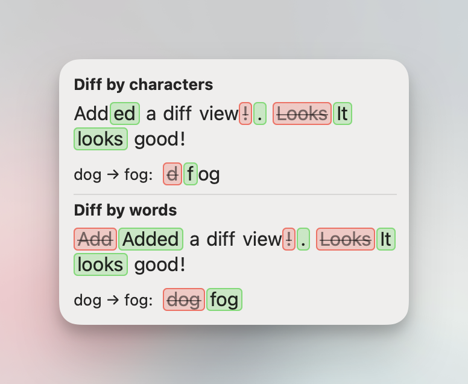

# TextDiff

TextDiff is a macOS Swift package that computes token-level diffs and renders a merged, display-only diff view for both SwiftUI (`TextDiffView`) and AppKit (`NSTextDiffView`) via the same custom AppKit renderer.



## Requirements

- macOS 14+
- Swift tools 6.1+

## Installation

Add TextDiff as a Swift Package dependency in Xcode or in `Package.swift`:

```swift
dependencies: [
    .package(url: "https://github.com/iSapozhnik/TextDiff.git", from: "1.0.0")
]
```

Then import:

```swift
import TextDiff
```

## Basic Usage

```swift
import SwiftUI
import TextDiff

struct DemoView: View {
    var body: some View {
        TextDiffView(
            original: "This is teh old sentence.",
            updated: "This is the updated sentence!",
            mode: .token
        )
        .padding()
    }
}
```

## AppKit Usage

```swift
import AppKit
import TextDiff

let diffView = NSTextDiffView(
    original: "This is teh old sentence.",
    updated: "This is the updated sentence!",
    mode: .token
)

// Constrain width in your layout. Height is intrinsic and computed from width.
diffView.translatesAutoresizingMaskIntoConstraints = false
```

You can update content in place:

```swift
diffView.mode = .character
diffView.original = "Add a diff"
diffView.updated = "Added a diff"
```

## Comparison Modes

```swift
TextDiffView(
    original: "Add",
    updated: "Added",
    mode: .character
)
```

- `.token` (default): token-level diff behavior.
- `.character`: refines adjacent word replacements by character so shared parts remain unchanged text (for example `Add` -> `Added` shows unchanged `Add` and inserted `ed`).

## Custom Styling

```swift
import SwiftUI
import TextDiff

let customStyle = TextDiffStyle(
    additionsStyle: TextDiffChangeStyle(
        fillColor: NSColor.systemGreen.withAlphaComponent(0.28),
        strokeColor: NSColor.systemGreen.withAlphaComponent(0.75)
    ),
    removalsStyle: TextDiffChangeStyle(
        fillColor: NSColor.systemRed.withAlphaComponent(0.24),
        strokeColor: NSColor.systemRed.withAlphaComponent(0.75),
        strikethrough: true
    ),
    textColor: .labelColor,
    font: .monospacedSystemFont(ofSize: 15, weight: .regular),
    chipCornerRadius: 5,
    chipInsets: NSEdgeInsets(top: 1, left: 3, bottom: 1, right: 3),
    interChipSpacing: 4,
    lineSpacing: 2
)

struct StyledDemoView: View {
    var body: some View {
        TextDiffView(
            original: "A quick brown fox jumps over a lazy dog.",
            updated: "A quick fox hops over the lazy dog!",
            style: customStyle
        )
    }
}
```

Change-specific colors and text treatment live under `additionsStyle` and `removalsStyle`. Shared layout and typography stay on `TextDiffStyle` (`font`, `chipInsets`, `interChipSpacing`, `lineSpacing`, etc.).

## Behavior Notes

- Tokenization uses `NLTokenizer` (`.word`) and reconstructs punctuation/whitespace by filling range gaps.
- Matching is exact (case-sensitive and punctuation-sensitive).
- Replacements are rendered as adjacent delete then insert segments.
- Character mode refines adjacent word replacements only; punctuation and whitespace keep token-level behavior.
- Whitespace changes preserve the `updated` layout and stay visually neutral (no chips).
- Rendering is display-only (not selectable) to keep chip geometry deterministic.
- `interChipSpacing` controls spacing between adjacent changed lexical chips (words or punctuation).
- `lineSpacing` controls vertical spacing between wrapped lines.
- Chip horizontal padding is preserved with a minimum effective floor of 3pt per side.
- No synthetic spacer characters are inserted into the rendered text stream.
- Chip top/bottom clipping is prevented internally via explicit line-height and vertical content insets.
- Moved text is not detected as a move; it appears as delete + insert.
- Rendering uses a custom AppKit draw view shared by both `TextDiffView` and `NSTextDiffView`.

## Snapshot Testing

Snapshot coverage uses [Point-Free SnapshotTesting](https://github.com/pointfreeco/swift-snapshot-testing) with `swift-testing`.

- Snapshot tests live in `Tests/TextDiffTests/TextDiffSnapshotTests.swift`.
- AppKit snapshot tests live in `Tests/TextDiffTests/NSTextDiffSnapshotTests.swift`.
- Baselines are stored under `Tests/TextDiffTests/__Snapshots__/TextDiffSnapshotTests/` and `Tests/TextDiffTests/__Snapshots__/NSTextDiffSnapshotTests/`.
- The suite uses `@Suite(.snapshots(record: .missing))` to record only missing baselines.

Run all tests:

```bash
swift test 2>&1 | xcsift --quiet
```

Update baselines intentionally:

1. Temporarily switch the suite trait in snapshot suites (for example, `Tests/TextDiffTests/TextDiffSnapshotTests.swift` and `Tests/TextDiffTests/NSTextDiffSnapshotTests.swift`) from `.missing` to `.all`.
2. Run `swift test 2>&1 | xcsift --quiet` once to rewrite baselines.
3. Switch the suite trait back to `.missing`.
4. Review snapshot image diffs in your PR before merging.
