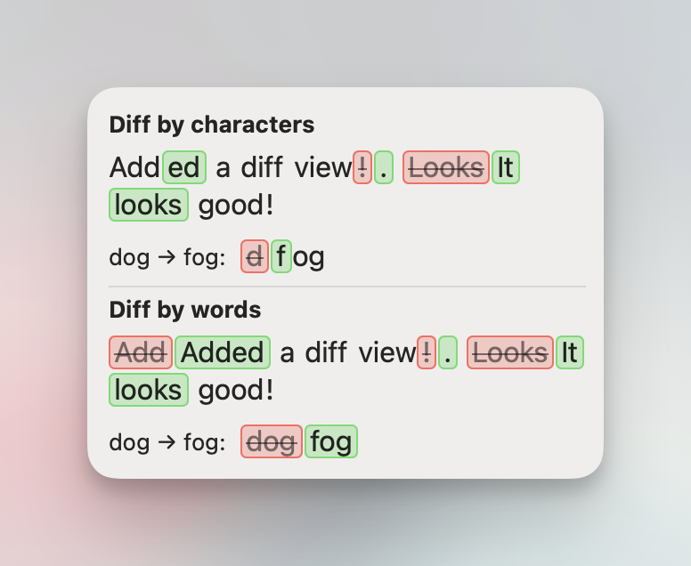

# TextDiff

TextDiff is a Swift package that computes token-level diffs and renders a merged, display-only diff view across Apple platforms. It supports SwiftUI on macOS and iOS, AppKit on macOS (`NSTextDiffView`), and UIKit on iOS (`UITextDiffView`).



## Requirements

- macOS 14+
- iOS 18+
- Swift tools 6.1+

## Installation

Add TextDiff as a Swift Package dependency in Xcode or in `Package.swift`:

```swift
dependencies: [
    .package(url: "https://github.com/iSapozhnik/TextDiff.git", from: "1.0.0")
]
```

Choose the product that matches how you want to use the package:

| Product | Use when |
| --- | --- |
| `TextDiff` | Default umbrella product for app code. |
| `TextDiffCore` | Engine-only diff computation with no UI. |
| `TextDiffUICommon` | Shared UI types for advanced module-level integrations. |
| `TextDiffMacOSUI` | Direct dependency on macOS UI APIs. |
| `TextDiffIOSUI` | Direct dependency on iOS UI APIs. |
 
## Which Product Should I Import?

- Use `import TextDiff` by default. It re-exports the common public API plus the matching platform UI module.
- Use `import TextDiffCore` when you only need diffing and result types without UI.
- Use `import TextDiffMacOSUI` or `import TextDiffIOSUI` only when you intentionally want direct platform module dependencies.
- Most app code should not need to import `TextDiffUICommon` separately.

Then import the module you chose:

```swift
import TextDiff
```

## SwiftUI Usage

```swift
import SwiftUI
import TextDiff

struct DemoView: View {
    var body: some View {
        TextDiffView(
            original: "This is teh old sentence.",
            updated: "This is the updated sentence!",
            mode: .token
        )
        .padding()
    }
}
```

## AppKit Usage (macOS)

```swift
import AppKit
import TextDiff

let diffView = NSTextDiffView(
    original: "This is teh old sentence.",
    updated: "This is the updated sentence!",
    mode: .token
)

// Constrain width in your layout. Height is intrinsic and computed from width.
diffView.translatesAutoresizingMaskIntoConstraints = false
```

You can update content in place:

```swift
diffView.mode = .character
diffView.original = "Add a diff"
diffView.updated = "Added a diff"
```

## UIKit Usage (iOS)

```swift
import UIKit
import TextDiff

let diffView = UITextDiffView(
    original: "This is teh old sentence.",
    updated: "This is the updated sentence!",
    mode: .token
)
```

## Comparison Modes

```swift
TextDiffView(
    original: "Add",
    updated: "Added",
    mode: .character
)
```

- `.token` (default): token-level diff behavior.
- `.character`: refines adjacent word replacements by character so shared parts remain unchanged text (for example `Add` -> `Added` shows unchanged `Add` and inserted `ed`).

## Engine-Only Results

You can compute a reusable diff result without rendering a view:

```swift
import TextDiff

let result = TextDiffEngine.result(
    original: "Track old values in storage.",
    updated: "Track new values in storage.",
    mode: .token
)

for change in result.changes {
    print(change.kind, change.text)
}

print(result.summary.insertedCharacters)
print(result.summary.deletedCharacters)
```

`TextDiffResult.changes` preserves the computed diff order for the selected mode and uses UTF-16 offsets/lengths so it can be stored and replayed consistently later. Summaries are derived from those mode-specific change records.

## Precomputed Rendering

If you already computed a diff result for storage or analytics, you can render it later without recomputing:

```swift
import SwiftUI
import TextDiff

let result = TextDiffEngine.result(
    original: "Track old values in storage.",
    updated: "Track new values in storage.",
    mode: .token
)

struct StoredDiffView: View {
    var body: some View {
        TextDiffView(result: result)
            .padding()
    }
}
```

AppKit has the same precomputed rendering path:

```swift
import AppKit
import TextDiff

let result = TextDiffEngine.result(
    original: "Track old values in storage.",
    updated: "Track new values in storage.",
    mode: .token
)

let diffView = NSTextDiffView(result: result)
```

UIKit has the same precomputed rendering path:

```swift
import UIKit
import TextDiff

let result = TextDiffEngine.result(
    original: "Track old values in storage.",
    updated: "Track new values in storage.",
    mode: .token
)

let diffView = UITextDiffView(result: result)
```

## Custom Styling

```swift
import SwiftUI
import TextDiff

let customStyle = TextDiffStyle(
    additionsStyle: TextDiffChangeStyle(
        fillColor: PlatformColor.systemGreen.withAlphaComponent(0.28),
        strokeColor: PlatformColor.systemGreen.withAlphaComponent(0.75)
    ),
    removalsStyle: TextDiffChangeStyle(
        fillColor: PlatformColor.systemRed.withAlphaComponent(0.24),
        strokeColor: PlatformColor.systemRed.withAlphaComponent(0.75),
        strikethrough: true
    ),
    textColor: PlatformColor.label,
    font: PlatformFont.monospacedSystemFont(ofSize: 15, weight: .regular),
    chipCornerRadius: 5,
    chipInsets: TextDiffEdgeInsets(top: 1, left: 3, bottom: 1, right: 3),
    interChipSpacing: 4,
    lineSpacing: 2
)

struct StyledDemoView: View {
    var body: some View {
        TextDiffView(
            original: "A quick brown fox jumps over a lazy dog.",
            updated: "A quick fox hops over the lazy dog!",
            style: customStyle
        )
    }
}
```

Change-specific colors and text treatment live under `additionsStyle` and `removalsStyle`. Shared layout and typography stay on `TextDiffStyle` (`font`, `chipInsets`, `interChipSpacing`, `lineSpacing`, etc.).

## macOS-Only Features

- Revert actions are available on macOS only.
- The invisible characters debug overlay is available on macOS only.
- The binding-based `TextDiffView` initializer is available on macOS only.

## Behavior Notes

- Tokenization uses `NLTokenizer` (`.word`) and reconstructs punctuation/whitespace by filling range gaps.
- Matching is exact (case-sensitive and punctuation-sensitive).
- Replacements are rendered as adjacent delete then insert segments.
- Character mode refines adjacent word replacements only; punctuation and whitespace keep token-level behavior.
- `TextDiffResult.changes` and `TextDiffResult.summary` are mode-specific outputs; `.token` and `.character` results are not normalized to each other.
- Whitespace changes preserve the `updated` layout and stay visually neutral (no chips).
- Rendering is display-only (not selectable) to keep chip geometry deterministic.
- Result-driven rendering (`TextDiffView(result:)`, `NSTextDiffView(result:)`) is display-only and does not enable revert actions.
- `interChipSpacing` controls spacing between adjacent changed lexical chips (words or punctuation).
- `lineSpacing` controls vertical spacing between wrapped lines.
- Chip horizontal padding is preserved with a minimum effective floor of 3pt per side.
- No synthetic spacer characters are inserted into the rendered text stream.
- Chip top/bottom clipping is prevented internally via explicit line-height and vertical content insets.
- Moved text is not detected as a move; it appears as delete + insert.
- Rendering uses a custom AppKit draw view shared by both `TextDiffView` and `NSTextDiffView`.

## Snapshot Testing

Snapshot coverage uses [Point-Free SnapshotTesting](https://github.com/pointfreeco/swift-snapshot-testing) with `swift-testing`.

- Engine tests live in `Tests/TextDiffCoreTests/`.
- UI and snapshot tests currently live in `Tests/TextDiffMacOSUITests/`.
- Snapshot suites live in `Tests/TextDiffMacOSUITests/TextDiffSnapshotTests.swift` and `Tests/TextDiffMacOSUITests/NSTextDiffSnapshotTests.swift`.
- Baselines are stored under `Tests/TextDiffMacOSUITests/__Snapshots__/`.
- The suite uses `@Suite(.snapshots(record: .missing))` to record only missing baselines.

Run all tests:

```bash
swift test 2>&1 | xcsift --quiet
```

Update baselines intentionally:

1. Temporarily switch the suite trait in snapshot suites (for example, `Tests/TextDiffMacOSUITests/TextDiffSnapshotTests.swift` and `Tests/TextDiffMacOSUITests/NSTextDiffSnapshotTests.swift`) from `.missing` to `.all`.
2. Run `swift test 2>&1 | xcsift --quiet` once to rewrite baselines.
3. Switch the suite trait back to `.missing`.
4. Review snapshot image diffs in your PR before merging.

## Performance Testing

- Performance baselines for `DiffLayouterPerformanceTests` are stored under `.swiftpm/xcode/xcshareddata/xcbaselines/TextDiffMacOSUITests.xcbaseline/`.
- `swift test` runs the performance tests, but it does not surface the committed Xcode baseline values in its output.
- For baseline-aware runs, use the generated SwiftPM workspace and the `TextDiff` scheme.

Run the layouter performance suite with Xcode:

```bash
xcodebuild -workspace .swiftpm/xcode/package.xcworkspace -scheme TextDiff -destination 'platform=macOS' -configuration Debug test -only-testing:TextDiffMacOSUITests/DiffLayouterPerformanceTests 2>&1 | xcsift
```

If you need the raw measured averages for comparison, run the same command once without `xcsift` because XCTest prints the per-test values directly in the plain `xcodebuild` output.
